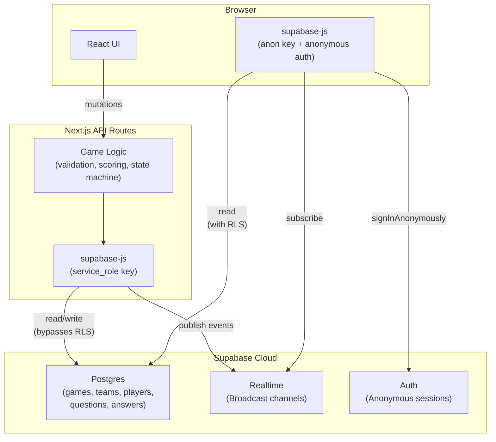

# Supabase Migration

## Architecture



**Key principle**: Clients subscribe to Supabase Broadcast for real-time events and read tables directly for initial state / reconnection. All mutations (create game, join, answer, host controls) go through API routes which use the `service_role` key to write to Postgres and publish Broadcast events.

## Database Schema

### Tables

**games**

- `id` UUID PK
- `game_code` TEXT UNIQUE (6-char)
- `title` TEXT
- `host_user_id` UUID FK auth.users -- anonymous host identity (replaces Host PIN)
- `game_password_hash` / `game_password_salt` TEXT -- for player join verification
- `status` TEXT CHECK (lobby, active_idle, round_active, round_ended, showing_results, game_over)
- `current_question_index` INTEGER DEFAULT -1
- `round_started_at` TIMESTAMPTZ
- `current_round_data` JSONB -- question text + options without correct answer (set by server on round start, safe for clients to read)
- `created_at` TIMESTAMPTZ

**teams** -- `id`, `game_id` FK, `name`, `color`, `sort_order`

**questions** -- `id`, `game_id` FK, `question_index`, `text`, `time_limit`, `correct_option_id`, `options` JSONB. **Never exposed to players via RLS.**

**players** -- `id`, `game_id` FK, `user_id` FK auth.users, `name`, `team_id` FK, `total_score` NUMERIC, `connected` BOOLEAN, `created_at`

**answers** -- `id`, `game_id` FK, `player_id` FK, `question_index`, `option_id`, `time_taken`, `score`. **Never exposed to players via RLS.** UNIQUE(game_id, player_id, question_index).

### RLS Policies

| Table     | SELECT                 | INSERT/UPDATE/DELETE           |
| --------- | ---------------------- | ------------------------------ |
| games     | Any authenticated user | service_role only (API routes) |
| teams     | Any authenticated user | service_role only              |
| questions | **Denied** (no policy) | service_role only              |
| players   | Any authenticated user | service_role only              |
| answers   | **Denied** (no policy) | service_role only              |

This protects correct answers and individual answer data. The `current_round_data` JSONB on `games` provides the safe, answer-stripped version of the current question.

### Indexes

- `games(game_code)` -- UNIQUE already implies index
- `teams(game_id)`
- `players(game_id)`
- `players(user_id, game_id)` -- UNIQUE constraint
- `answers(game_id, player_id, question_index)` -- UNIQUE constraint
- `questions(game_id, question_index)` -- UNIQUE constraint

## Auth Model

- **Supabase Anonymous Auth**: Each browser session gets a persistent anonymous identity. No signup/login UI needed.
- **Host identity**: `games.host_user_id = auth.uid()`. Host PIN is **removed** -- the anonymous session IS the host's proof of ownership.
- **Player identity**: `players.user_id = auth.uid()`. The game password is still required to join.
- **API route auth**: Server extracts `user_id` from the Supabase JWT sent in the request cookie. Uses `@supabase/ssr` `createServerClient` to read the session, then switches to admin client for writes.
- **Config change**: Set `enable_anonymous_sign_ins = true` in [supabase/config.toml](supabase/config.toml) AND in the Supabase cloud dashboard (Authentication > Settings).

## Realtime: Broadcast

Channel name: `game:{gameCode}` (e.g. `game:NWZQJ5`)

**Server publishes** (in API routes, via admin client):

- `game:start` -- `{ status, totalQuestions }`
- `round:start` -- `{ question: { text, options, timeLimit, questionIndex }, roundStartedAt }`
- `round:answer_count` -- `{ totalAnswers, totalPlayers }`
- `round:end` -- `{ correctOptionId, answerDistribution, totalAnswers }`
- `leaderboard:update` -- `{ individual: [...], teams: [...] }`
- `game:end` -- `{ leaderboard, totalRounds, totalPlayers }`
- `player:joined` -- `{ player: {...}, totalPlayers }`

**Clients subscribe** (via browser supabase-js):

```typescript
supabase.channel(`game:${gameCode}`)
  .on('broadcast', { event: 'round:start' }, ({ payload }) => { ... })
  .on('broadcast', { event: 'round:end' }, ({ payload }) => { ... })
  // ...all events
  .subscribe();
```

## File Changes

### New files

- `supabase/migrations/00001_initial_schema.sql` -- Full schema + RLS + indexes
- `lib/supabase/client.ts` -- Browser client (`createBrowserClient` from `@supabase/ssr`)
- `lib/supabase/server.ts` -- Server client for reading session from cookies
- `lib/supabase/admin.ts` -- Admin client with `service_role` key (singleton)
- `lib/supabase/broadcast.ts` -- Helper to publish Broadcast events from API routes
- `hooks/use-supabase.ts` -- Provider hook: initializes anonymous session, exposes Supabase client
- `.env.local` -- `NEXT_PUBLIC_SUPABASE_URL`, `NEXT_PUBLIC_SUPABASE_ANON_KEY`, `SUPABASE_SERVICE_ROLE_KEY`

### Major refactors

- **[lib/game-manager.ts](lib/game-manager.ts)** -- Remove in-memory Maps and SSE connection management. Replace with Supabase queries (via admin client) and Broadcast publishing. Keep scoring, validation, and state machine logic. Timer `setTimeout` for auto-ending rounds stays (queries DB when it fires).
- **[lib/types.ts](lib/types.ts)** -- Remove `SSEConnection`, `SSEEventType`. Add Supabase row types (or generate from schema). Remove `hostPinHash`/`hostPinSalt` from `GameSession`.
- **[hooks/use-game-events.ts](hooks/use-game-events.ts)** -- Replace `EventSource` with Supabase Realtime Broadcast subscription. Same event callback interface so the reducer hook needs minimal changes.
- **[hooks/use-game-state.ts](hooks/use-game-state.ts)** -- Minimal changes (reducer actions stay the same, just the event source changes).
- **[app/play/[gameCode]/page.tsx](app/play/[gameCode]/page.tsx)** -- Read initial state from Supabase tables (instead of REST fetch). Remove REST polling fallback (Broadcast replaces it). Initialize anonymous auth.
- **[app/host/[gameCode]/page.tsx](app/host/[gameCode]/page.tsx)** -- Same: read from Supabase, subscribe to Broadcast. Host is authenticated by `host_user_id` matching `auth.uid()`.
- **[app/host/create/page.tsx](app/host/create/page.tsx)** -- Remove Host PIN field. Initialize anonymous session before creating game.
- **[components/player/JoinForm.tsx](components/player/JoinForm.tsx)** -- No host PIN references. Flow stays the same.
- **All API routes** (`app/api/game/...`) -- Replace `gameManager` in-memory calls with Supabase admin queries + Broadcast publishing. Authenticate requests via Supabase JWT.

### Delete

- `lib/db.ts` -- lowdb is replaced by Supabase
- `app/api/game/[gameCode]/events/route.ts` -- SSE endpoint replaced by Supabase Broadcast

### Dependencies

- **Add**: `@supabase/supabase-js`, `@supabase/ssr`
- **Remove**: `lowdb`

## Migration & Deployment Steps

1. Enable anonymous sign-ins in Supabase cloud dashboard
2. Update `supabase/config.toml`: `enable_anonymous_sign_ins = true`
3. Create `.env.local` with Supabase credentials
4. Run `supabase db push` to apply migration to cloud project
5. Install Supabase packages: `pnpm add @supabase/supabase-js @supabase/ssr && pnpm remove lowdb`
