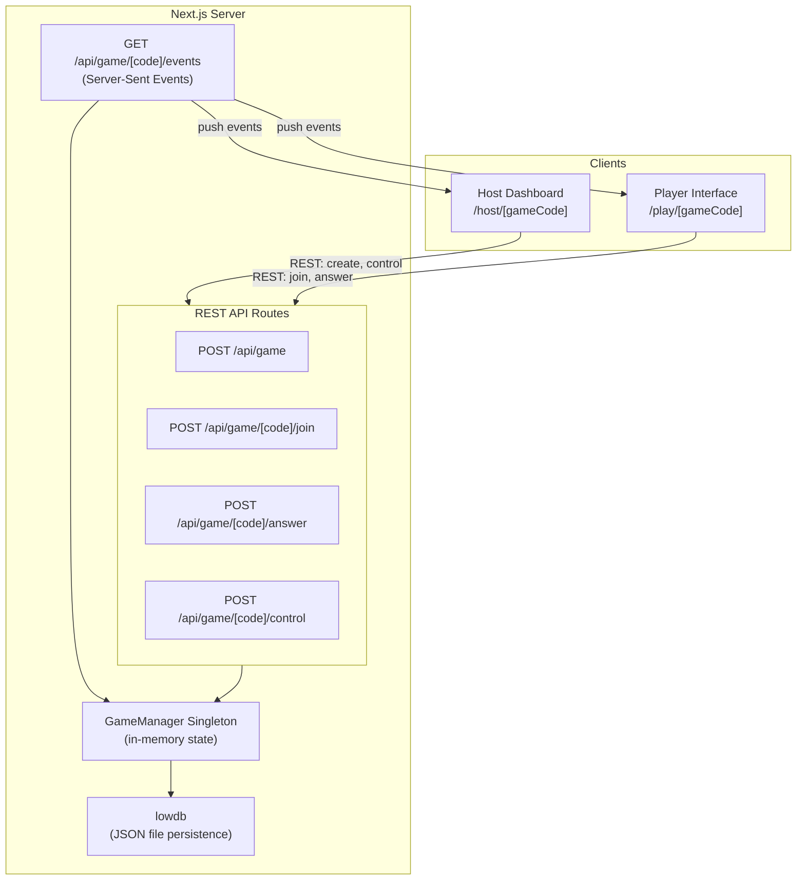
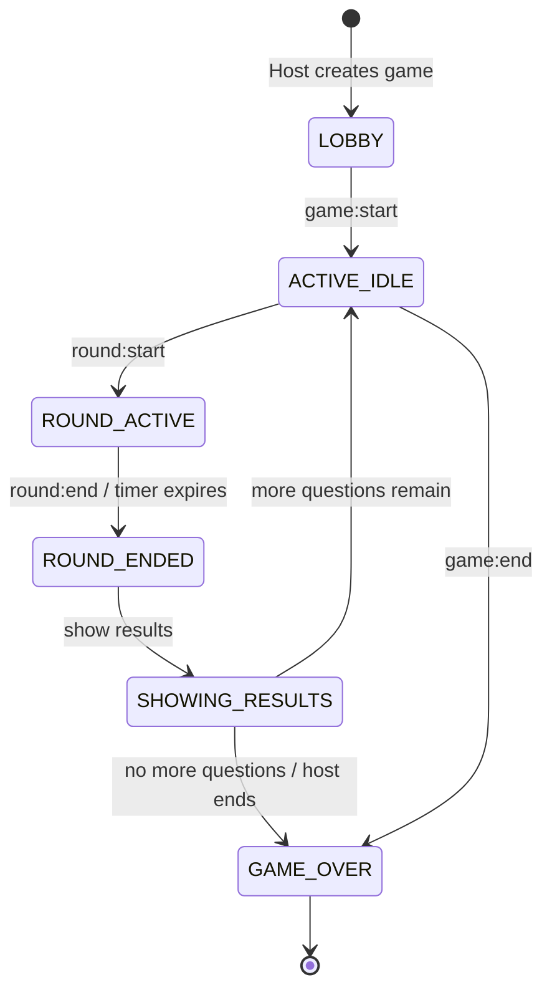

# Real-Time Multiplayer Trivia Game

## Architecture Overview



## Game State Machine



Players can join during LOBBY, ACTIVE_IDLE, ROUND_ACTIVE, ROUND_ENDED, and SHOWING_RESULTS (mid-game joining).

## File Structure

```
lib/
  types.ts              # All TypeScript interfaces (Game, Player, Team, Question, Round, etc.)
  game-manager.ts       # Singleton: in-memory game state, SSE broadcasting, game logic
  scoring.ts            # Score calculation with time-decay formula
  hash.ts               # Password hashing with node:crypto scrypt
  sanitize.ts           # HTML entity encoding for user inputs
  db.ts                 # lowdb setup for JSON file persistence

app/
  page.tsx              # Landing page: Join or Host buttons
  host/
    create/page.tsx     # Create game form (host PIN, game password, teams, question upload)
    [gameCode]/page.tsx # Host dashboard (split view: controls + live stats)
  play/
    [gameCode]/page.tsx # Player interface (lobby → question → result → leaderboard)

  api/game/
    route.ts                       # POST: create game
    [gameCode]/
      route.ts                     # GET: current game state (for reconnection)
      join/route.ts                # POST: join game (password + name + teamId)
      events/route.ts              # GET: SSE stream (real-time events)
      answer/route.ts              # POST: submit answer
      control/route.ts             # POST: host actions (action: start|nextRound|endRound|showResults|endGame)

components/
  host/
    GameControls.tsx        # Start/Next Round/End Round/Show Results/End Game buttons
    QuestionPreview.tsx     # Current question display for host
    AnswerDistribution.tsx  # CSS-based bar chart of answer counts per option
    PlayerList.tsx          # Connected players grouped by team
    LiveStats.tsx           # Real-time response counter
  player/
    JoinForm.tsx            # Game code + password + name input
    TeamSelect.tsx          # Team selection grid
    Lobby.tsx               # Waiting room with player list
    QuestionView.tsx        # Question + 4 large colored answer buttons + timer
    ResultView.tsx          # Correct/incorrect feedback + score animation
  shared/
    Leaderboard.tsx         # Individual + team leaderboard with podium top-3
    CountdownTimer.tsx      # Animated circular countdown
    TeamBadge.tsx           # Colored team indicator

hooks/
  use-game-events.ts       # SSE consumer hook (EventSource wrapper)
  use-game-state.ts        # Client-side game state reducer

data/
  sample-questions.json    # Example question file
```

## Key Design Decisions

### Real-time: SSE + REST (no custom server)

- **SSE endpoint** (`/api/game/[gameCode]/events`): Uses `ReadableStream` in a Next.js route handler. A `GameManager` singleton maintains a `Map<gameCode, Set<SSEConnection>>`. When a game event occurs, it iterates all connections and writes SSE-formatted data. Client disconnect is detected via `request.signal` abort event.
- **REST endpoints**: Standard POST route handlers for all client actions. Each mutates the in-memory game state and triggers SSE broadcasts.
- **Authentication via query params** for SSE (since `EventSource` doesn't support headers): `?token=xxx&role=host|player`. All REST calls use an `Authorization: Bearer <token>` header.

### Authentication

- **Host**: On game creation, host sets a Host PIN (hashed with scrypt and stored). Returns a `hostToken` (UUID). All host control actions require this token. The host dashboard URL includes the game code; the token is stored in `sessionStorage`.
- **Player**: On join, player provides the game password (verified against hash). Returns a `playerToken` (UUID). Used for answer submission and SSE connection.

### Scoring

```typescript
// lib/scoring.ts
function calculateScore(timeTaken: number, timeLimit: number): number {
  // Score = 1 * (1 - timeTaken/timeLimit), minimum 0
  return Math.max(0, 1 * (1 - timeTaken / timeLimit));
}
```

Scores are rounded to 2 decimal places. Team score = sum of all member scores.

### Security

- Passwords hashed with `node:crypto` scrypt (no external dependency)
- Correct answers stored server-side only; `round:start` event sends question + options without `correctOptionId`
- `round:end` event includes the correct answer after the round closes
- All user inputs (display names, team names) sanitized by stripping HTML entities server-side
- React's JSX escaping provides additional client-side XSS protection

### Persistence (lowdb)

- `data/db.json`: Stores game sessions (game config, players, teams, round results)
- In-memory `GameManager` is the primary data source for real-time operations
- lowdb syncs at key milestones: game creation, player join, round end, game end
- SSE connection handles live in-memory only (not serializable)

### Question JSON Schema

```json
{
  "title": "My Trivia Game",
  "questions": [
    {
      "text": "What is the capital of France?",
      "options": [
        { "id": "a", "text": "London" },
        { "id": "b", "text": "Paris" },
        { "id": "c", "text": "Berlin" },
        { "id": "d", "text": "Madrid" }
      ],
      "correctOptionId": "b",
      "timeLimit": 20
    }
  ]
}
```

The host uploads this file via a file input on the create game page. Validated server-side.

### UI Design

- **Color palette**: Bold Kahoot-inspired colors. Answer options use 4 fixed colors: Red (#E21B3C), Blue (#1368CE), Yellow (#D89E00), Green (#26890C) with corresponding shapes (triangle, diamond, circle, square).
- **Host dashboard**: Two-column layout on desktop (left: question preview + controls, right: live stats + player list). Stacks vertically on mobile.
- **Player question screen**: Full-screen question text at top, 2x2 grid of large tappable color-coded buttons below, floating countdown timer.
- **Leaderboard**: Top 3 shown in podium style (2nd | 1st | 3rd), remaining in scrollable list with rank change arrows.
- **Dark theme** by default with high-contrast colors for readability.

### No Additional Dependencies

Everything is achievable with the existing stack:

- `node:crypto` for hashing (built-in)
- `crypto.randomUUID()` for token generation (built-in)
- CSS-based bar charts (no charting library)
- `EventSource` for SSE client (built-in browser API)
- `lowdb` already installed
