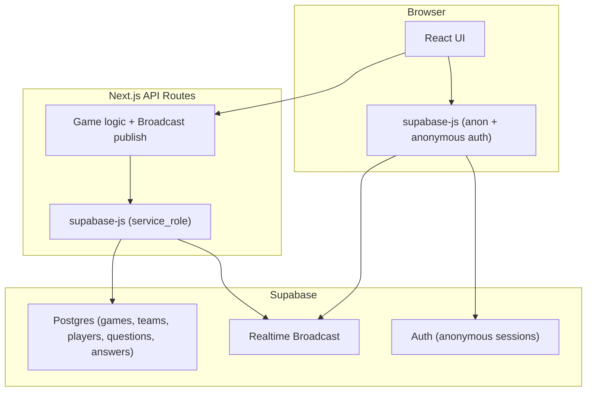

# Trivia Game

Real-time multiplayer trivia game (Kahoot-style) built with Next.js 16, React 19, and Tailwind CSS v4.

## Getting Started

For local development, you need a Supabase project. Either create one at [database.new](https://database.new/) and use its URL/keys, or run `supabase start` for local Supabase and use `http://127.0.0.1:54321` with the local keys.

```bash
pnpm install
cp .env.example .env.local
# Edit .env.local with your Supabase URL, anon key, and service role key
pnpm dev
```

Open [http://localhost:3000](http://localhost:3000) in your browser.

## How It Works

1. **Host** creates a game at `/host/create` — sets a game password, teams, and uploads a questions JSON file
2. **Host** receives a 6-character game code and is redirected to the dashboard at `/host/[code]`
3. **Players** join at `/play/[code]` — enter the game password, a display name, and select a team
4. **Host** controls the game flow: Start Game → Next Round → End Round → Show Results → End Game
5. Players answer questions in real-time, scored on correctness and speed

## Architecture

- Host and players use anonymous Supabase sessions
- All mutations (create game, join, answer, host controls) go through Next.js API routes
- API routes use `service_role` to write to Postgres and publish Broadcast events
- Clients subscribe to Supabase Realtime Broadcast channels for real-time game state (round start, answer counts, leaderboard, etc.)



## Question JSON Format

Upload a JSON file when creating a game. The file should follow this schema:

```json
{
  "title": "My Trivia Game",
  "questions": [
    {
      "text": "What is the capital of France?",
      "options": [
        { "id": "a", "text": "London" },
        { "id": "b", "text": "Paris" },
        { "id": "c", "text": "Berlin" },
        { "id": "d", "text": "Madrid" }
      ],
      "correctOptionId": "b",
      "timeLimit": 20
    }
  ]
}
```

Each question requires:

- `text` — the question text
- `options` — exactly 4 options, each with `id` and `text`
- `correctOptionId` — the `id` of the correct option
- `timeLimit` — seconds for the round (5–120)

A sample file is provided at `data/sample-questions.json`.

## Scoring

- Correct answer: `Score = 1 × (1 - time_taken / time_limit)`
- Incorrect/no answer: 0 points
- Team score: sum of all team members' individual scores

## Tech Stack

- **Next.js 16** with App Router and React Compiler
- **React 19** with Supabase Realtime Broadcast for real-time updates
- **Tailwind CSS v4** with dark theme
- **Supabase** — Postgres (games, teams, players, questions, answers), Auth (anonymous sessions), Realtime Broadcast (game events)

## Environment Variables

| Variable                        | Description                                                     |
| ------------------------------- | --------------------------------------------------------------- |
| `NEXT_PUBLIC_SUPABASE_URL`      | Supabase project URL                                            |
| `NEXT_PUBLIC_SUPABASE_ANON_KEY` | Supabase anon (public) key                                      |
| `SUPABASE_SERVICE_ROLE_KEY`     | Supabase service role key (server-only, never expose to client) |

Create `.env.local` with these values from the Supabase dashboard (Settings > API).

## Self-Hosting

**Prerequisites**: Node 24 (or compatible), pnpm, Supabase CLI, Cloudflare account (for tunnel). Optional: [mise](https://mise.jdx.dev/) for tooling (this project includes `cloudflared` and `supabase` in `mise.toml`).

**Steps**:

1. **Clone the repo**
   ```bash
   git clone <repo-url>
   cd trivia
   pnpm install
   ```

2. **Create a Supabase project**
   - Go to [database.new](https://database.new/) or [Supabase Dashboard](https://supabase.com/dashboard)
   - Create a new project, note the URL and keys from Settings > API

3. **Run migrations**
   ```bash
   supabase link --project-ref <your-project-ref>
   supabase db push
   ```
   Or manually: run the SQL in `supabase/migrations/00001_initial_schema.sql` in the Supabase SQL Editor

4. **Enable anonymous auth** (if not already)
   - Supabase Dashboard > Authentication > Providers > Anonymous Sign-Ins: enable

5. **Configure environment**
   - Copy `.env.example` to `.env.local` and fill in Supabase URL, anon key, service role key

6. **Build and run locally**
   ```bash
   pnpm build
   pnpm start
   ```

7. **Expose via Cloudflare Tunnel**
   - Install `cloudflared` (e.g. `brew install cloudflared` or via mise)
   - **Quick tunnel** (temporary URL, for testing):
     ```bash
     cloudflared tunnel --url http://localhost:3000
     ```
   - **Named tunnel** (persistent hostname):
     - `cloudflared tunnel login`
     - `cloudflared tunnel create trivia`
     - Create `~/.cloudflared/config.yml` with `url: http://localhost:3000` and tunnel credentials
     - `cloudflared tunnel route dns trivia <your-subdomain>.yourdomain.com`
     - `cloudflared tunnel run trivia`

8. **Supabase Auth redirect URLs** (if using a custom domain)
   - Supabase Dashboard > Authentication > URL Configuration
   - Add your tunnel URL (e.g. `https://trivia.yourdomain.com`) to Site URL and Redirect URLs

**Important**: This app is designed for temporary, single-game-session use when self-hosted via Cloudflare Tunnel. Long-running sessions and production-grade security (rate limiting, DDoS hardening, etc.) are not guaranteed. Use for casual games with trusted participants, not as a persistent public service.
